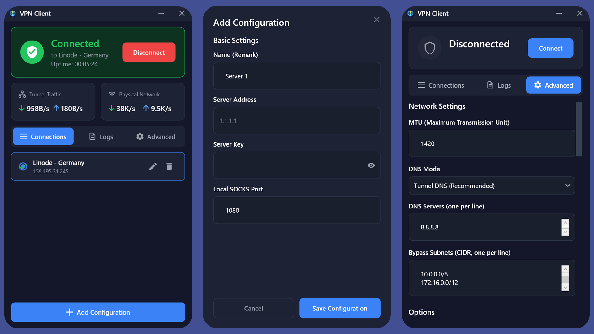

# PingTunnel VPN Client (Windows)

<p align="center">
  
</p>

System-wide VPN tunneling over ICMP using pingtunnel + tun2socks + Wintun, wrapped in a modern WPF client.

## App UI Screenshot



## Features

- ICMP-based tunneling via pingtunnel
- Wintun TUN adapter with system-wide routing
- Real-time tunnel + physical traffic speed display
- DNS leak protection with built-in DNS forwarder + cache
- UDP blocking on TUN interface to prevent QUIC/UDP failures
- Health monitoring + auto-restart on high latency
- Split-tunnel support (bypass subnets)
- Crash recovery and orphaned firewall cleanup
- Config import/export + live logs

## Download

Grab the latest release from GitHub:

- **Installer (recommended)**: installs the app, creates uninstaller, optional desktop shortcut
- **Portable (self-contained)**: single EXE, no install required
- **Portable (framework-dependent)**: smaller size, requires .NET Desktop Runtime

## Install (Installer)

1. Download the installer `.exe`
2. Run as Administrator
3. Choose optional desktop shortcut during setup

## Portable

1. Download the portable `.zip`
2. Extract anywhere
3. Run the EXE **as Administrator**

## Requirements

- Windows 10/11 (x64)
- Administrator privileges (required for routes/DNS/firewall)
- .NET 8 Desktop Runtime for framework-dependent builds

## Quick Start

1. Add or import a server config
2. Set **Server Address** and **Server Key**
3. Click **Connect**

## Build from Source

```powershell
cd "PingTunnel-VPN-Client"
.\scripts\build.ps1 -Release
```

Output:

- `dist\` (self-contained single EXE + Resources)
- `dist-framework\` (framework-dependent publish output)

## Release Pipeline

This repo includes a GitHub Actions workflow that builds:

- Portable self-contained EXE + ZIP
- Portable framework-dependent EXE + ZIP
- Installer EXE (Inno Setup, optional desktop shortcut)

Tag a release like `v1.2.3` to publish.

## Security / Legal

**Use only on networks and systems you own or have explicit permission to administer.**  
Unauthorized use may violate laws or policies.

## Troubleshooting (Quick)

- **Not elevated**: Right‑click → Run as Administrator
- **Binaries missing**: Ensure `Resources` contains `pingtunnel.exe`, `tun2socks.exe`, `wintun.dll`
- **ICMP blocked**: Your network may block ping; try another network
- **DNS leaks**: Ensure “Tunnel DNS” mode is selected

## License

MIT for this client. Third‑party components have their own licenses; see `THIRD_PARTY_NOTICES.md`.
